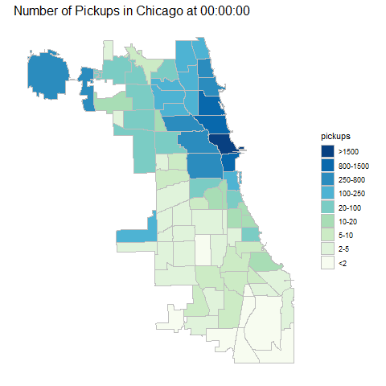
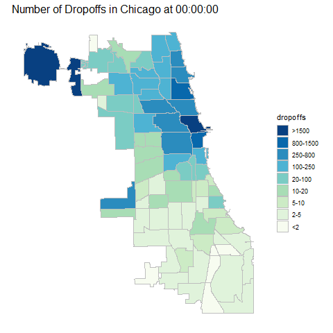

# Predicting Chicago Taxi Fare

## Purpose of the Model
This model uses the Chicago Taxi Trip dataset. (https://www.kaggle.com/chicago/chicago-taxi-trips-bq)  

The goal of this project is to predict the fare price at the beginning of the ride, based on the available information: date and time of the ride, the pickup and drop off locations, the taxi driver’s anonymous ID and the company that provides the ride. 

Predicting the fare serves two purposes: First, it gives the passengers an expectation of the fare. Second, it prevents the meters’ mistakes in calculating the fare. In the dataset, we have seen impossible data, which could cause mistakes in fare calculations. For example,one trip was 15 minutes in duration but the distance traveled was 2000+ miles. The predicted fares could be used as a benchmark to evaluate the meters’ fares calculated to prevent mistakes. 

## Data Exploration and Data Analysis
We offer two versions of data analysis files for the clients. 

### Version 1: an.py file with the data analysis functions.

File Name: data_explore.py 

An examplar .ipynb file that loads the .py file and executes the prebuilt functions: run_data_prep.ipynb

The client can load this file into their Jupyter Notebook using the line:
~~~
# Load the .py file
%run data_explore.py
~~~

Then call the pre-built functions. For example, to get the general descriptive statistics, such as min and median, of the columns.
~~~
data_describe(df)
~~~

### Version 2: A .ipynb file showing the step by step Python scripts to explore the data.
It is located in the exploratory-analysis folder:

/exploratory-analysis/chicago-taxi-fare-exploratory-analysis.ipynb 

The info below is based on the Version 2 file. But the same functions can be achieved using the file in Version 1.

### Data Sample
1M rows of data were extracted from Big Query using SQL. Apparently, the more data the better. However, since the purpose of this project is to evaluate the methodology, we only used a subset of the data in order to cut down costs.  

### Data Extraction and Basic Data Transformation Using Big Query
Thanks to Big Query’s powerful functions, some new features were created during data extraction for further explorations. These features were selected based on general experience in Machine Learning.

- Transforming the pickup and drop off data time from UTC to Chicago local
- Extracting the date, hour, day of the week, month and year from the pickup datetime
- Calculating the duration of the trip using beginning and ending time
- Marking trips that started or ended in an airport based on the community areas

~~~
# Pull data and feature engineering 
# The training data set will include 1M rows
# Feature engineering to generate new columns: 
#Year, Date, Hour, Weekday of the trip, whether the trip starts or end in an airport, duration of the trip in minutes.

sql="""
with tmp_tb as (
SELECT
    unique_key, 
    taxi_id, 
    DATETIME(trip_start_timestamp, 'America/Chicago') trip_start_timestamp, 
    DATETIME(trip_end_timestamp, 'America/Chicago') trip_end_timestamp, 
    trip_miles, 
    pickup_census_tract, 
    dropoff_census_tract, 
    pickup_community_area, 
    dropoff_community_area, 
    payment_type, 
    company, 
    pickup_latitude, 
    pickup_longitude, 
    dropoff_latitude, 
    dropoff_longitude,
    fare fare_dollars
FROM
    `bigquery-public-data.chicago_taxi_trips.taxi_trips` 
WHERE 
    fare > 0 and fare is not null and trip_miles > 0 and trip_miles is not null
ORDER BY 
    RAND()
LIMIT 1000000)
SELECT *, 
    CAST(trip_start_timestamp AS DATE) trip_start_dt,
    CAST(trip_end_timestamp AS DATE) trip_end_dt,
    DATETIME_DIFF(trip_end_timestamp, trip_start_timestamp, MINUTE) trip_minutes,
    EXTRACT(YEAR FROM trip_start_timestamp) year,
    EXTRACT(MONTH FROM trip_start_timestamp) month,
    EXTRACT(DAY FROM trip_start_timestamp) day,
    EXTRACT(HOUR FROM trip_start_timestamp) hour,
    FORMAT_DATE('%a', DATE(trip_start_timestamp)) weekday,
    CASE WHEN (pickup_community_area IN (56, 64, 76)) OR (dropoff_community_area IN (56, 64, 76)) THEN 1 else 0 END is_airport
FROM tmp_tb
"""

df = client.query(sql).to_dataframe()
~~~

### General Exploration of the Data
This step helps us understand:

- data types of each column

~~~
df.dtypes
~~~

- the outliers or implausible data, such as trips with duration of 15 minutes but distance of 1000+ miles which suggested that additional data filtering was needed

~~~
df.describe()
~~~

- number of missing values for each column and across the dataset.

~~~
# missing values
print(df.isnull().sum())
~~~

- the statistical properties of the columns, such as its distribution. 

~~~
# plot the distribution of fare
sns.kdeplot(df_4.fare_dollars, shade=True)
~~~

Most of the fare were under $2000 per trip. There are a few big numbers, which needs further explorations on if they are legit fare prices or bad data.

~~~
# make a copy of the original data
df_2 = df.copy()

## Check how many rides are share rides. Include only non-shared rides
# If two unique_key have the same taxi_id and trip_start_timestamp, it is considered a shared ride

aggregations = {
    'unique_key':{
        'passengers': 'count'
    },
    'fare_dollars':{
        'max_fare': 'max', 
        'min_fare': 'min'
    }   
}

df_share_rides = df_2[['unique_key', 'taxi_id', 'trip_start_timestamp', 'fare_dollars']].groupby(['taxi_id', 'trip_start_timestamp']).agg(aggregations)
df_share_rides.columns = df_share_rides.columns.get_level_values(1)
df_share_rides.head()

# Filter to include only the rides that are not share rides
# For modeling purposes, only include the ones that are not share rides, to get an accurate estimation of the fare

df_3 = df_2.merge(df_share_rides, left_on=['taxi_id', 'trip_start_timestamp'], right_on=['taxi_id', 'trip_start_timestamp'], how='left')
df_4 = df_3.loc[df_3.passengers == 1]
df_4.shape
~~~

It shows that only about 1% are share rides.

### Explore the Relationships Among Metrics
This step aimed to explore the relationships between different columns, including the relationships between different columns and fare.

Some feature engineering were used, such as extracting the hour of the day and day of the week from the pickup_datetime column. 

Tools used included statistical testing, such as correlation analysis, and visualization, including scatterplots, time-lapse animation and geographical plots.

~~~
df_4['mmdd'] = df_4.trip_start_timestamp.map(lambda x: x.strftime('%m-%d'))
fig = plt.figure()
ax1 = df_4.pivot_table('unique_key', index='hour', columns='year', aggfunc=lambda x: len(x.unique())).plot(figsize=(8,5))
plt.title('Number of Rides by Pickup Hour')
~~~

~~~
fig = plt.figure()
ax1 = df_4.pivot_table('fare_dollars', index='hour', columns='year').plot(figsize=(8, 5))
plt.title('Average Fare($) per Ride by Pickup Time')
~~~

~~~
fig = plt.figure()
ax1 = df_4.pivot_table('trip_miles', index='hour', columns='year').plot(figsize=(8, 5))
plt.title('Average Fare($) per Ride by Pickup Time')
~~~

~~~
fig = plt.figure()
ax1 = df_4.pivot_table('unique_key', index='mmdd', columns='year', aggfunc=lambda x: len(x.unique())).plot(figsize=(16,8))
plt.title('Number of Rides by Day')
~~~

Explores the locations of the rides
~~~
# This function plots the rides on a map of chicago
def plot_data_points(longitude, latitude, data_frame, focus_point) :
    cvs = ds.Canvas(plot_width=500, plot_height=400)
    export  = partial(export_image, export_path = "export", background="black")
    agg = cvs.points(data_frame, longitude, latitude, ds.count())
    img = transfer_functions.shade(agg, cmap= hot, how='eq_hist')
    image_xpt  =  transfer_functions.dynspread(img, threshold=0.5, max_px=4)
    return export(image_xpt,"map")
~~~
~~~
# pickup locations
plot_data_points('pickup_longitude', 'pickup_latitude', df_4, 'unique_key')
~~~

~~~
# plot of dropoff location
plot_data_points('dropoff_longitude', 'dropoff_latitude', df_4, 'unique_key')
~~~

Explore the relations between pickup/dropoff locations and time of the day.

Explore relationships between trip duration, trip length and fares

~~~
plt.scatter(df_4.trip_miles, df_4.fare_dollars, s = 1)
plt.xlabel('Trip Miles')
plt.ylabel('Fare($)')
~~~

It seems that there are a few rides with a much longer trip miles and fare amount. The following plot will zoom in to the trip with 500 miles or less, and fare dollars below 300.
 
Zooming in.

~~~
plt.scatter(df_4.trip_miles.loc[(df_4.trip_miles <=500) & (df_4.fare_dollars <=300)], 
            df_4.fare_dollars.loc[(df_4.trip_miles <=500) & (df_4.fare_dollars <=300)], 
            s = 1)
plt.xlabel('Trip Miles')
plt.ylabel('Fare($)')
~~~ 
 
Check how many rides have are 500 miles or less, and cost $300 or less.
~~~
df_4.trip_miles.loc[(df_4.trip_miles <=500) & (df_4.fare_dollars <=300)].shape
~~~

The results show (998528,). 99.7% of the trips were less than 500 miles and less than 300 dollars.

    
Two conclusions came out of this analysis:
1. The following factors were relevant in predicting the taxi fare: hour of the day when the trip started, day of the week, distance of the trip, locations of the pickup and drop off, where the trip started from or ended in an airport area.
2. There seemed to be two lines of services: premium services and regular services, based on the rates. 

In predicting whether a ride is a premium service, there are two hypothesis:
(1) a certain company mostly provides one type of service;
(2) a certain taxi_id always provides a premium or normal service.
It is also possible that a driver provides premium services when affiliated with a certain company, but might provide normal services when affiliated with another company.

The next steps is to explore which companies tend to provide premium services, and which drivers have provied premium services.

### Identifying Premium vs Regular Taxi Services
#### Clustering the Drivers
The analysis above suggested that there were two rates: a premium one and a regular one. Correctly identifying which group the driver falls into would increase the accuracy of fare prediction. A clustering analysis of the drivers was performed to reach this goal.

The drivers were profiled based on the metrics of their previous rides, such as the number of rides, total revenue, average dollars per mile, average miles per trip, etc. Analysis of this data showed that the drivers could be clustered based on the dollars per mile and average miles per trip, as drivers that provided premium services had higher average dollars per mile, and smaller miles per trip.

Then a KMean clustering analysis was performed. Different number of clusters (k) were tested and the results revealed that having two clusters provides a good balance between the complexity and explanatory power.

The result of the clustering was merged with the original data. 

#### Identifying Companies that Provide Premium Services
Analysis of the dollars per mile for each company showed a clear cut off among companies. Companies that had higher dollars per mile were marked in the column ‘is_luxury”.

~~~
aggregations = {
    'unique_key':{
        'rides': 'count'
    },
    'fare_dollars':{
        'total_fare': 'sum'    
    },
    'trip_miles':{
        'total_miles': 'sum'
    }
}

by_company = df_4.groupby('company').agg(aggregations)
by_company.columns = by_company.columns.get_level_values(1)
by_company['miles_per_trip'] = by_company.total_miles/by_company.rides
by_company['dollars_per_mile'] = by_company.total_fare/by_company.total_miles
by_company.sort_values(['dollars_per_mile'], ascending = False).head()
~~~

~~~
#### It seems that Blue Ribbon Taxi Association Inc. mainly provides premium experience, at a large scale.
##### Create one column, is_luxury, to mark the company that provides premium experience.
df_4['is_luxury'] = np.where(df_4.company.isin(['Blue Ribbon Taxi Association Inc.', 'Suburban Dispatch LLC']), 1, 0)
~~~

Examine the trips provided by different taxi drivers

~~~
# Profiling the taxi_ids, showing miles_per_trip and dollars_per_mile for each taxi_id
aggregations = {
    'unique_key':{
        'rides': 'count'
    },
    'fare_dollars':{
        'total_fare': 'sum'    
    },
    'trip_miles':{
        'total_miles': 'sum'
    }
}

by_driver = df_4.groupby('taxi_id').agg(aggregations)
by_driver.columns = by_driver.columns.get_level_values(1)
by_driver['miles_per_trip'] = by_driver.total_miles/by_driver.rides
by_driver['dollars_per_mile'] = by_driver.total_fare/by_driver.total_miles
by_driver.sort_values(['dollars_per_mile'], ascending = False).head()
~~~

Use KMeans clustering to cluster the drivers into different groups.

~~~
# Standardize the data for clustering
by_driver_standard = stats.zscore(by_driver[['dollars_per_mile']])
~~~

Two Clusters
~~~
# KMeans clustering
k2 = KMeans(n_clusters = 2, random_state = 0).fit(by_driver_standard)
by_driver['k2'] = k2.labels_
by_driver.groupby(['k2']).mean()

# Plot the clustering results
plt.scatter(by_driver.dollars_per_mile, by_driver.miles_per_trip, c = -by_driver.k2)
plt.xlabel('dollars per mile')
plt.ylabel('miles per trip')
plt.title('KMeans Results (k = 2)')
~~~

Three Clusters
~~~
k3 = KMeans(n_clusters = 3, random_state = 0).fit(by_driver_standard)
by_driver['k3'] = k3.labels_
by_driver.groupby(['k3']).mean()

plt.scatter(by_driver.dollars_per_mile, by_driver.miles_per_trip, c = by_driver.k3)
plt.xlabel('dollars per mile')
plt.ylabel('miles per trip')
plt.title('KMeans Results (k = 3)')
~~~

Four Clusters

~~~
# try four clusters
k4 = KMeans(n_clusters = 4, random_state = 0).fit(by_driver_standard)
by_driver['k4'] = k4.labels_
by_driver.groupby(['k4']).mean()

plt.scatter(by_driver.dollars_per_mile, by_driver.miles_per_trip, c = by_driver.k4)
plt.xlabel('dollars per mile')
plt.ylabel('miles per trip')
plt.title('KMeans Results (k = 4)')
~~~

Combine the KMeans Clustering results with the original data

~~~
df_5 = df_4.merge(by_driver, left_on=['taxi_id'], right_on='taxi_id', how='left')
~~~

Filter data for training.

The purpose of the filtering is that certain data were considered bad data, becuase they were unrealistic or illegal or both, such as several hundred miles per hour, etc.  The purpose of the modeling is to predict the correct fare as a benchmark, so using the cleaned data is important.

~~~
# the upper limit of acceptable fare: 4 sd 
fare_upper = df_5.describe().fare_dollars['mean'] + 4 * df_4.describe().fare_dollars['std']
count = sum(df.fare_dollars > fare_upper)

print ('The upper limit of fare (4sd) is: $', fare_upper, '.\n', count, 'rides are above the upper limit')
~~~

Results show that: "The upper limit of fare (4sd) is: $ 139.72892967657037 . 164 rides are above the upper limit".

~~~
# The upper limit of distance is arbitrary, because most trips are concentrated on the lower end, making the sd small
distance_upper = 300

count = sum(df.trip_miles > distance_upper)
print (count, 'rides are 300 miles or longer.')
~~~

Results show that "89 rides are 300 miles or longer."

~~~
# Filter data based on on fare and trip miles, and mph, since we can't expect a future ride to exceed mph. It's illegal!
df_5['mph'] = df_5.trip_miles/df_5.trip_minutes * 60
df_6 = df_5.loc[(df_5.mph < 90) & (df_5.fare_dollars <= fare_upper) & (df_5.trip_miles <= distance_upper)]

# plot 
plt.scatter(df_6.trip_miles, df_6.fare_dollars, c = df_6.k2, s = 1, alpha = 0.5)
plt.show()
~~~

Plot the trip milesa and fare dollars based on the two groups for Group 1.
~~~
plt.scatter(df_6.trip_miles.loc[df_6.k2 == 1], df_6.fare_dollars.loc[df_6.k2 == 1], s = 1, alpha = 0.5)
plt.show()
~~~

~~~
plt.scatter(df_6.trip_miles.loc[df_6.k2 == 0], df_6.fare_dollars.loc[df_6.k2 == 0], s = 1, alpha = 0.5)
plt.show()
~~~

k = 2 provides a good balance between complexity and explanatory purposes 

##  Feature Selection
Based on the exploratory analysis, we identified the features that suggest correlations with the fare prices. The features include:
- pickup_latitude
- pickup_longitude
- dropoff_latitude
- dropoff_longitude
- weekday (day of the week)
- is_luxury(if the company tend to provide premium services)
- k2(cluster of the driver based on the clustering results)

# Modeling

## Input
- pickup_latitude
- pickup_longitude
- dropoff_latitude
- dropoff_longitude
- weekday (day of the week)
- is_luxury(if the company tend to provide premium services)
- k2(cluster of the driver based on the clustering results)

Data that had mileage per hour (mph) of 90 or above, or the trip miles is above 300, or the fare is above 4 standard deviations, were removed. 

## Data Preparation with Executable Code
The executable code for prepping the training and eval data are train_data_prep.py and eval_data_prep.py.

## Preparing the training data. 

File: train_data_prep.py

Executing this file, it does the following steps:
- data extraction
- data cleaning
- clustering the drivers and match the cluster ID to the rides
- save the clustering results to GCS bucket.
- clearn data and select columns
- upload the files to the designated GCS bucket.

The parameters in this file can be changed in the command line, such as 'bucket_name'. 

The image below shows the exeution of the file. 

Files generated after running the train_data_prep.py

## Preparing the eval data.

File: eval_data_prep.py

Executing this file, it does the following:
- data extraction
- data clearning
- extract the clustering results from the GCS bucket. 
- match the rides data with the cluster data, based on taxi id
- find the cluster for the taxi id. If the taxi id doesn't exist in the clustering results, assign the most popular cluster id
- clearn data and select columns
- upload the file to the designated GCS bucket.

Same as above, the parameters can be customized in the command line. The image below shows how to run the command.

## Preparing the prediction data.

File: pred_data_prep.py

The functions are similar to the eval_data_prep.py, except that the pred data does not have the 'fare_dollars' column. Also, it doens't have a header.

## Bucketization, Crossing Columns and Embedding Columns
We bucketized the hour of the day, as well as the pick up and dropoff latitude and longitude. This is because these features because they are fundamentally categorical features when it comes to their impact on the taxi fare. Also, for the longitude and latitude data, we do not need the extra small level of granularity.

We crossed columns the pick up and drop off latitude and longitude. This is becuase the it's the joint of the pick up and drop off, latitude and longitude, that together determine the fare.

We embedded the columns to group them together.

## Estimator: DNNLinearCombinedRegressor
The estimator used is DNNLinearCombinedRegressor from the tensorflow.estimator. This built-in estimator fits the use of this model and make it easy to use.

We have tested XGBoost and DNNRegressor, but this model has the best performance. Our original thought was to pick the best performing model based on the rmse, becuase this is a Kaggle project. We agree with the feedback that this model is more complicated and more difficult to understand. In the future, when we are facing such as choice in a client work, we would communicate the pros and cons to the client and make a joint decision.

## Tuning Hyperparametesr using Hypertune
We used Hypertune to tune the number of nodes in each layer. The goal is to minimize the **Root Mean Squared Error (RMSE)**. The parameters are set in the config.yaml file.

### Why is RMSE chosen as a measure of the magnitude of error?

One common alternative of using RMSE is Mean Absolute Error (MAE). Both measure the magnitude of errors.

One main difference is that RMSE places more weights on the larger errors, because of the sqaured errors. 

Suppose we want to predict the fare of 10 rides. 
- Model 1: the prediction is off by $1 for all 10 rides. 
- Model 2: the prediction is exactly the same for 9 rides, but $10 lower for the last one. 
MAE would generate the same results, so the two models are considered to have the same performance; however, based on RMSE, Model 2 is worse.

In the current model, large errors are particularly undesiable. Taxi riders might be more tolerant to small variation of the predicted price, while a large difference would put them in a really bad mood. When it comes to money, we try to avoid big surprises. Therefore, we choose RMSE, which penalizes large errors. 

### Parameters Tuned
- number of layers
- nodes in each layer by specifying: (1) The number of nodes in the 1st layer; (2) layer-wise reduction rate
- learning rates

The job for hypertuning is training ml_job21. 

~~~~
!gcloud ml-engine jobs submit training ml_job21 \
--job-dir=gs://taxi_exps_4/MLEngine/ml_job1 \
--runtime-version=1.10 \
--region=us-central1 \
--module-name=trainer.task \
--package-path=trainer \
--config=config.yaml
~~~~

The job shows the hyperparameters and the performance indicator: rmse.

The logs are saved in a cloud bucket:

To check the results to see which model is the best:
~~~~
from googleapiclient import discovery
from google.oauth2 import service_account
import pandas as pd
import json

profect_id_name = 'hackathon1-183523'
project_id = 'projects/{}'.format(profect_id_name)
job_name = 'ml_job21'
job_id = '{}/jobs/{}'.format(project_id, job_name)

# Build the service
ml = discovery.build('ml', 'v1')

# Execute the request and pass in the job id
request = ml.projects().jobs().get(name=job_id).execute()

# The best model
request['trainingOutput']['trials'][0]
~~~~

### Summary of Hypertune Results

The best model has a 2 layers, 206 for layer 1 and ceiling(206*0.68) = 150 for layer 2, learning rate of 0.00001 and batch size of 64.

## Deployment and Predictions
The model used is taxi_fare_forecast_3, v5.
The job name for the prediction is ml_job23

~~~~
!gcloud ml-engine jobs submit prediction ml_job23 \
    --model=taxi_fare_forecast_3 \
    --input-paths=gs://taxi_fare_4/data/csv/test.csv \
    --output-path=gs://taxi_exps_4/data/prediction_output/ \
    --region=us-central1 \
    --data-format=TEXT \
    --signature-name=predict \
    --version=v5
~~~~

If we click the job, we will see:

## Results

Download the results and transform it into a dataframe.

~~~~   
results_ls = []
for line in open('pred_results.txt', 'r'):
    results_ls.append(json.loads(line))
    
results = []
for item in results_ls:
    for data_item in item['predictions']:
        results.append(data_item)
~~~~

Calculate the rmse of the predicted results and actual data.

~~~~
from sklearn.metrics import mean_squared_error
from math import sqrt

rmse = sqrt(mean_squared_error(results, test.fare_dollars))
print('RMSE is: ', rmse)
~~~~

# Security Concerns

Our data includes the Taxi ID, taxi company's names and the details of the taxi rides. The taxi IDs are anonymoused. The taxi drivers' info are not available. And the taxi riders' info does not exist in the dataset. 

Also, we kept the data within the GCP's secured infrastructure during the whole process. 

# Reference
1. Google Cloud Platform: https://github.com/GoogleCloudPlatform/professional-services/tree/master/examples/cloudml-energy-price-forecasting

2. Kaggle: https://www.kaggle.com/chicago/chicago-taxi-trips-bq

3. The Security of Google Cloud: https://cloud.google.com/security/
