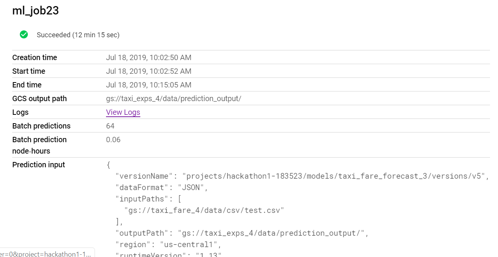
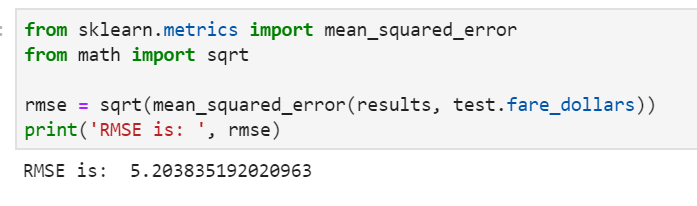

# Predicting Chicago Taxi Fare

## Purpose of the Model
This model uses the Chicago Taxi Trip dataset. (https://www.kaggle.com/chicago/chicago-taxi-trips-bq)  

The goal of this project is to predict the fare price at the beginning of the ride, based on the available information: date and time of the ride, the pickup and drop off locations, the taxi driver’s anonymous ID and the company that provides the ride. 

Predicting the fare serves two purposes: First, it gives the passengers an expectation of the fare. Second, it prevents the meters’ mistakes in calculating the fare. In the dataset, we have seen impossible data, which could cause mistakes in fare calculations. For example,one trip was 15 minutes in duration but the distance traveled was 2000+ miles. The predicted fares could be used as a benchmark to evaluate the meters’ fares calculated to prevent mistakes. 

## Data Exploration and Data Analysis
### Data Sample
1M rows of data were extracted from Big Query using SQL. Apparently, the more data the better. However, since the purpose of this project is to evaluate the methodology, we only used a subset of the data in order to cut down costs.  

### Data Extraction and Basic Data Transformation Using Big Query
Thanks to Big Query’s powerful functions, some new features were created during data extraction for further explorations. These features were selected based on general experience in Machine Learning.

- Transforming the pickup and drop off data time from UTC to Chicago local
- Extracting the date, hour, day of the week, month and year from the pickup datetime
- Calculating the duration of the trip using beginning and ending time
- Marking trips that started or ended in an airport based on the community areas

### General Exploration of the Data
This step helps us understand:
- data types of each column
- descriptive analysis of each column (e.g., mean, standard deviation and max value)
- number of missing values for each column and across the dataset.
- the statistical properties of the columns, such as its distribution. 
- the outliers or implausible data, such as trips with duration of 15 minutes but distance of 1000+ miles which suggested that additional data filtering was needed. 

### Explore the Relationships Among Metrics
This step aimed to explore the relationships between different columns, including the relationships between different columns and fare.

Some feature engineering were used, such as extracting the hour of the day and day of the week from the pickup_datetime column. 

Tools used included statistical testing, such as correlation analysis, and visualization, including scatterplots, time-lapse animation and geographical plots.

Two conclusions came out of this analysis:
1. The following factors were relevant in predicting the taxi fare: hour of the day when the trip started, day of the week, distance of the trip, locations of the pickup and drop off, where the trip started from or ended in an airport area.
2. There seemed to be two lines of services: premium services and regular services, based on the rates. 

Because of  the second conclusion, the next step was to figure out how to determine the type of services for each ride. 

### Identifying Premium vs Regular Taxi Services
#### Clustering the Drivers
The analysis above suggested that there were two rates: a premium one and a regular one. Correctly identifying which group the driver falls into would increase the accuracy of fare prediction. A clustering analysis of the drivers was performed to reach this goal.

The drivers were profiled based on the metrics of their previous rides, such as the number of rides, total revenue, average dollars per mile, average miles per trip, etc. Analysis of this data showed that the drivers could be clustered based on the dollars per mile and average miles per trip, as drivers that provided premium services had higher average dollars per mile, and smaller miles per trip.

Then a KMean clustering analysis was performed. Different number of clusters (k) were tested and the results revealed that having two clusters provides a good balance between the complexity and explanatory power.

The result of the clustering was merged with the original data. 

#### Identifying Companies that Provide Premium Services
Analysis of the dollars per mile for each company showed a clear cut off among companies. Companies that had higher dollars per mile were marked in the column ‘is_luxury”.

##  Summary of Relevant Features
The features below were generated:
When extracting data from Big Query:
- Transforming the pickup and drop off data time from UTC to Chicago local
- Extracting the date, hour of the day, day of the week, month and year from the pickup datetime
- Calculating the duration of the trip using beginning and ending time
- Marking trips that started or ended in an airport based on the community areas

In Jupyter Notebook:
- Marking the service level, premium vs regular, of each driver based on the clustering results
- Marking the service level of the company based on the dollars per mile of the trips provided in the past

# Modeling

## Input
- pickup_latitude
- pickup_longitude
- dropoff_latitude
- dropoff_longitude
- weekday (day of the week)
- is_luxury(if the company tend to provide premium services)
- k2(cluster of the driver based on the clustering results)

Data that had mileage per hour (mph) of 90 or above, or the trip miles is above 300, or the fare is above 4 standard deviations, were removed. 

## Estimator: DNNLinearCombinedRegressor
The estimator used is DNNLinearCombinedRegressor from the tensorflow.estimator. This built-in estimator fits the use of this model and make it easy to use.

## Tuning Hyperparametesr using Hypertune
We used Hypertune to tune the number of nodes in each layer. The goal is to minimize the Root Mean Squared Error (RMSE). The parameters are set in the config.yaml file.

The job for hypertuning is training taxi_fare_5. 

~~~~
!gcloud ml-engine jobs submit training taxi_fare_5\
        --job-dir=gs://taxi_fare_4/job_folder/taxi_fare_model_5\
        --runtime-version=1.10 \
        --region=us-central1 \
        --module-name=trainer.task \
        --package-path=trainer \
        --config=config.yaml
~~~~

The job shows the hyperparameters and the performance indicator: rmse.

The logs are saved in a cloud bucket:

To check the results to see which model is the best:
~~~~
from googleapiclient import discovery
from google.oauth2 import service_account
import pandas as pd
import json

profect_id_name = 'hackathon1-183523'
project_id = 'projects/{}'.format(profect_id_name)
job_name = 'taxi_fare_5'
job_id = '{}/jobs/{}'.format(project_id, job_name)

# Build the service
ml = discovery.build('ml', 'v1')

# Execute the request and pass in the job id
request = ml.projects().jobs().get(name=job_id).execute()

# The best model
request['trainingOutput']['trials'][0]
~~~~

## Deployment and Predictions
The model used is taxi_fare_forecast_3, v4.
The job name for the prediction is taxi_fare_pred_4

The job for prediction is taxi_fare_model_45. 
~~~~
!gcloud ml-engine jobs submit prediction taxi_fare_pred_4 \
    --model=taxi_fare_forecast_3 \
    --input-paths=gs://taxi_fare_4/data/csv/test.csv \
    --output-path=gs://taxi_fare_4/data/prediction_output/ \
    --region=us-central1 \
    --data-format=TEXT \
    --signature-name=predict \
    --version=v4
~~~~

If we click the job, we will see:

## Results

Download the results and transform it into a dataframe.

~~~~
! gsutil cp gs://taxi_fare_4/data/prediction_output/prediction.results-00000-of-00001 pred_results.json
   
results_ls = []
for line in open('pred_results.txt', 'r'):
    results_ls.append(json.loads(line))
    
results = []
for item in results_ls:
    for data_item in item['predictions']:
        results.append(data_item)
~~~~

Calculate the rmse of the predicted results and actual data.

~~~~
from sklearn.metrics import mean_squared_error
from math import sqrt

rmse = sqrt(mean_squared_error(results, test.fare_dollars))
print('RMSE is: ', rmse)
~~~~

# Reference
1. Google Cloud Platform: https://github.com/GoogleCloudPlatform/professional-services/tree/master/examples/cloudml-energy-price-forecasting

2. Kaggle: https://www.kaggle.com/chicago/chicago-taxi-trips-bq
